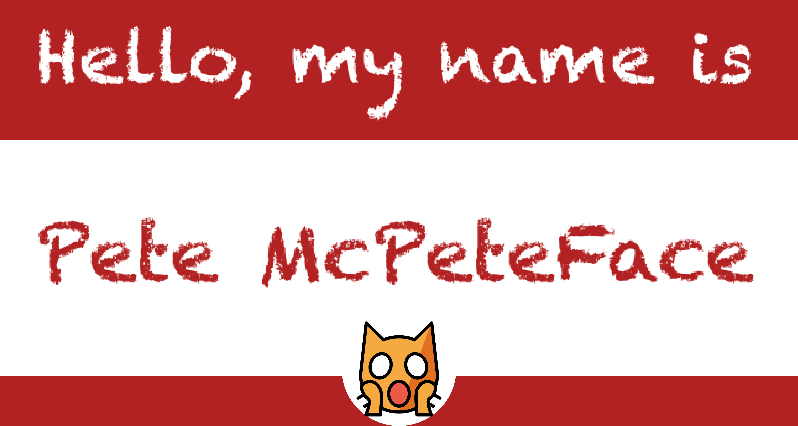

# Hello

Run script [hello](./hello) to generate 'hello my name is ...' badges.

If an A6 thermo printer is attached, the `hello` script will print a badge, perfect for hackathons and meetups in general.

# System Requirements

Tested on Raspberry Pi 400, known to not working on MacOS (bluez not installable).

# Usage

This script uses `chafa` for rendering the badge in ascii art on the command line and python's pygame / ppa6 to create and print the badge. Please install [chafa](https://github.com/hpjansson/chafa) anyway you like. And follow the [pyenv](#pyenv) steps to install the python dependencies.

:warning: This script is known to not work on MacOS, please use a Raspberry Pi :warning:

## pyenv

This script is written in python and it is recomeneded to use python venv. Activate it by using `python -m venv venv`. It creates a new folder `venv`. To activate that environment use `source venv/bin/activate`. Now that the environment is activated use `pip install -r requirements.txt` to install all dependencies. 

Finally executing

> ./hello

will start the badge creator.

In the welcoming menu, type `verbs` to find out what else to do:
 
`help`

Use `start` to start the badge printing. A name of `exit` will exit the badge creation. Entering `exit` in the *main menu* will exit the main menu.

The user will get attracted by an attached screen, sees random images and is able to just print a badge, after entering a name and a number. The number references a predermined array of emoji or image pathes, and renderes them at the bottom center of the badge. This image / emoji is of great use for team building, and converstation starters.

Please feel free to read through the screen text to find out more what it can do.

Also: Rainbows.

# Feedback

Any feedback is appreciated:

* developers@telekom.de
* [issues](https://github.com/dt-developers/hello-my-name-is/issues)
